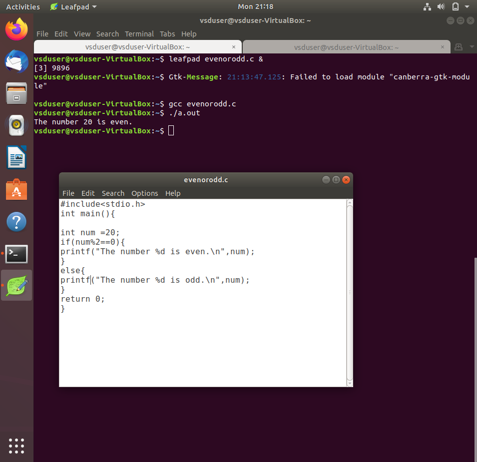
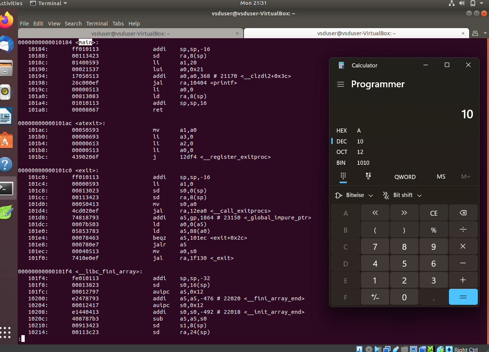
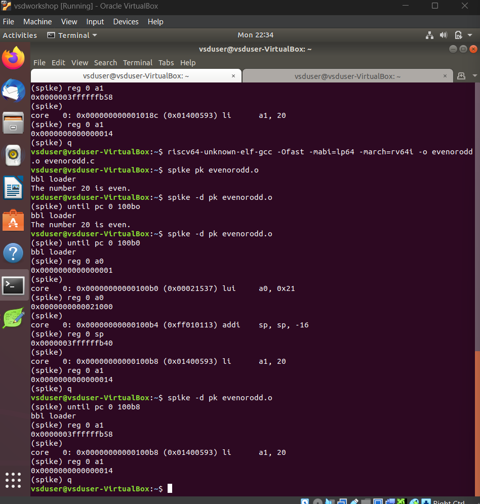

# Samsung RISC-V  
This program is based on the RISC-V  architecture and uses open-source tools to teach people about vlsi chip design and RISC-V. The instructor for this internship is Kunal Ghosh Sir.

# Basic Details
Name: PS Chandana

College: Sahyadri College of Engineering and Management

Email ID: chandana250404@gmail.com

GitHub Profile: PsChandana-Sahyadri-ECE

LinkedIN Profile: PS Chandana


---

<details>
<summary> <b>Task 1:</b> The task involves  reviewing the C based lab video and the RISC-V architecture based lab video to gain a comprehensive understanding of both topics.Then the C code is compiled using two different compilers: the GCC compiler and the RISC-V compiler.</summary> 
<br>
Task is to refer to C based and RISCV based lab videos and execute the task of compiling the C code using gcc and riscv compiler.

**C Language based LAB**

**C and RISC-V Based Labs**

This repository demonstrates the processes involved in compiling C programs and generating assembly code using both a standard GCC compiler and a RISC-V GCC compiler. It includes comprehensive steps and explanations to guide users through each stage of the compilation and debugging workflow.

**C Language-Based Lab**

Steps to Compile a .c File on Your Machine:

1. Open the bash terminal and navigate to the directory where you want to create your file.
2. Use the following command to create and edit a new .c file:
   ```sh
   leafpad sum1ton.c


**Steps to Compile a .c File on our Machine:**
 ```sh
 gcc sum1ton.c
 ./a.out
```

 
Compilation and execution complete.
 


RISC-V Based Lab

**Steps to Compile Using RISC-V GCC Compiler:**
1. Ensure the RISC-V GCC compiler is installed and accessible on your system.
2. Verify the .c file contents using the cat command:
   ```sh
   cat sum1ton.c


3. Compile the C program for RISC-V architecture using 01 option:
 ```sh
riscv64-unknown-elf-gcc -o1 -mabi=lp64 -march=rv64i -o sum1ton.o sum1ton.c
```
4. Disassemble the object file to view its assembly code using:
 ```sh
riscv64-unknown-elf-objdump -d sum1ton.o
```
5.minimize the assembly by using following code:
```sh
riscv64-unknown-elf-objdump -d sum1ton.o | less
```
 a)we extract main function's assembly code by using:
   ```sh
/main
```
6. Use /main in the terminal to locate the main function in the assembly output.


7.Compile the C program for RISC-V architecture using ofast option:
```sh
riscv64-unknown-elf-gcc -Ofast -mabi=lp64 -march=rv64i -o sum1ton.o sum1ton.c
```
8.Disassemble the object file to view its assembly code using:
```sh
riscv64-unknown-elf-objdump -d sum1ton.o
```
9.minimize the assembly by using following code:
```sh
riscv64-unknown-elf-objdump -d sum1ton.o | less
```
 a)we extract main function's assembly code by using:
 ```sh
  /main
```
10. Use /main in the terminal to locate the main function in the assembly output.

)

Explanation of Key Commands and Options: 
1. -mabi=lp64: Specifies the Application Binary Interface (ABI) for 64-bit integers, pointers, and long data types, suitable for 64-bit RISC-V architecture.

2. -march=rv64i: Indicates the 64-bit RISC-V base integer instruction set architecture.

3. -O1: Enables basic optimization for better performance without significantly increasing compilation time.

4. -Ofast: Optimize the code aggressively for the best possible speed.

5. riscv64-unknown-elf-objdump: A tool for disassembling RISC-V binaries to examine the code structure and debug it effectively.
 
   </details>

---

<details>
<summary> <b>Task 2:</b> The task involves reviewing both C-based and RISC-V-based lab videos to understand the nuances of compiling C code for different architectures. Afterward, you are required to execute the process of compiling the C code using two distinct tools: the GCC compiler and the RISC-V compiler simulator. This will allow you to demonstrate your ability to work with both compilers, providing insights into how the C code is processed and converted into machine-readable code for each specific architecture.</summary> 
<br>

Task is to analyze the SPIKE simulation performance using RISC-V GCC with -O1 and -Ofast optimization levels.  

*SPIKE Simulation and Compiler Optimization*

This repository demonstrates how to compile a C program using RISC-V GCC, simulate it using SPIKE, and compare the performance of different optimization levels (-O1 and -Ofast). It includes detailed steps and explanations to ensure clarity.  

**Steps to Complete the Task**  

1.Write a Simple C Program  

2.The following program calculates the addition of two numbers: 

3.Compile Using RISC-V GCC

4.Compile with -O1 Optimization.

*Use the following command to compile the program with the -O1 optimization flag:*
```sh
riscv64-unknown-elf-gcc -O1 -mabi=lp64 -march=rv64i -o swift.o swift.c
```
**Disassemble Object Files to View Assembly Code(in new terminal)**
*Generate Dump for -O1 Optimization*
```sh
riscv64-unknown-elf-objdump -d swift.o
```
*Minimize the assembly by using following code:*
```sh
riscv64-unknown-elf-objdump -d swift.o | less
```



**Run SPIKE Simulation**
*Run a compiled RISC-V program on the SPIKE simulator in non-debug mode.*
```sh
spike pk swift.o
```
*Invoke the debug mode of the SPIKE RISC-V simulator.*
```sh
spike -d pk swift.o
```



**Compile with -Ofast Optimization.**
*Use the following command to compile the program with the -Ofast optimization flag:*
```sh
riscv64-unknown-elf-gcc -Ofast -mabi=lp64 -march=rv64i -o swift.o swift.c
```
**Disassemble Object Files to View Assembly Code(in new terminal)**
*Generate Dump for -Ofast Optimization*
```sh
riscv64-unknown-elf-objdump -d swift.o
```
*Minimize the assembly by using following code:*
```sh
riscv64-unknown-elf-objdump -d swift.o | less
```



**Run SPIKE Simulation**
*Run -O1 Binary in SPIKE*
```sh
spike pk swift.o
```
*Invoke the debug mode of the SPIKE RISC-V simulator*
```sh
spike -d pk swift.o
```
![compiling with Ofast option]Task 2/task2_Ofast_objdump.png)


**After(spike -d pk swift.o) Observe the Instructions:**

1)After loading, SPIKE initializes and displays the Program Counter (PC) and Stack Pointer (SP).

2)Press Enter repeatedly to step through the execution.

3)Each press displays the next instruction executed by the program.

4)The displayed instructions directly correspond to the C code of the main program, providing insights into the program's execution flow.
**Explanation of Key Commands and Options:**

1. spike:RISC-V simulator that runs RISC-V programs on a virtual machine.

2. pk:Proxy kernel that acts as a minimal runtime environment for RISC-V programs, handling system calls like I/O and memory management.

3. swift.o:The compiled RISC-V binary of your program (created using a RISC-V GCC compiler).

4. -d (for debugging):Debugging mode in SPIKE, allows stepping through the instructions and inspecting the program's behavior.

5. riscv64-unknown-elf-gcc:RISC-V GCC compiler used to compile the C program into a RISC-V object file (.o).

6. -O1, -Ofast:Compiler optimization flags:
      a.-O1: Basic optimizations for performance.
      b.-Ofast: Aggressive optimizations for maximum speed.

7. riscv64-unknown-elf-objdump:Disassembles RISC-V binaries to examine assembly code.

These tools together enable compiling, running, and debugging RISC-V programs on a simulated environment.

</details>

---

---
<details>
<summary><b>Task 3:</b> The goal is to analyze and categorize each of the provided instructions based on their type, whether it be R-type, I-type, or J-type, and then translate them into their respective 32-bit machine instruction codes. These instruction codes should be represented in the appropriate format, ensuring that each instruction is properly encoded according to the specific structure and opcode requirements of the given architecture. The result should provide a detailed mapping of the instructions to their corresponding binary code representations.</summary>

# Understanding RISC-V and Its Instruction Formats

## What is RISC-V?
RISC-V is an open-source Instruction Set Architecture (ISA) that enables developers to design processors tailored to specific applications. Based on Reduced Instruction Set Computer (RISC) principles, RISC-V represents the fifth generation of processors built on this concept. Its open and free nature means developers can utilize RISC-V without purchasing licenses, making it a compelling alternative to proprietary processor technologies.

## Instruction Formats in RISC-V
The instruction format of a processor defines how machine language instructions are structured for execution. These instructions are composed of binary data (0s and 1s), each segment providing details about data location and operations to be performed. In RISC-V, there are six primary instruction formats:

1. **R-format**
2. **I-format**
3. **S-format**
4. **B-format**
5. **U-format**
6. **J-format**


---

### 1. R-type Instruction
R-type (Register-type) instructions operate on registers rather than memory locations. These are used for arithmetic and logical operations. Each instruction is 32 bits and divided into six fields:

#### Structure:

| Field Name | Size  | Description                            |
|------------|-------|----------------------------------------|
| Opcode     | 7 bits| Determines the instruction type        |
| rd         | 5 bits| Destination register                  |
| func3      | 3 bits| Specifies the type of operation       |
| rs1        | 5 bits| First source register                 |
| rs2        | 5 bits| Second source register                |
| func7      | 7 bits| Additional operation specification    |

#### Example: ADD r9, r2, r5
- **Operation:** Adds values in registers r2 and r5, storing the result in r9.
- **Field Breakdown:**

  - Opcode: `0110011`
  - rd (Destination): `r9` -> `01001`
  - rs1 (Source 1): `r2` -> `00010`
  - rs2 (Source 2): `r5` -> `00101`
  - func3: `000`
  - func7: `0000000`
- **32-bit Instruction:** `0000000_00101_00010_000_01001_0110011`


#### Example: XOR r10, r1, r4
- **Operation:** XOR operation between r1 and r4, result in r10.
- **Field Breakdown:**

  - Opcode: `0110011`
  - rd (Destination): `r10` -> `01010`
  - rs1 (Source 1): `r1` -> `00001`
  - rs2 (Source 2): `r4` -> `00100`
  - func3: `100`
  - func7: `0000000`
- **32-bit Instruction:** `0000000_00100_00001_100_01010_0110011`


#### Example: SLT r11, r2, r4
- **Operation:** Sets r11 to 1 if r2 < r4; otherwise, sets r11 to 0.
- **Field Breakdown:**

  - Opcode: `0110011`
  - rd (Destination): `r11` -> `01011`
  - rs1 (Source 1): `r2` -> `00010`
  - rs2 (Source 2): `r4` -> `00100`
  - func3: `010`
  - func7: `0000000`
- **32-bit Instruction:** `0000000_00100_00010_010_01011_0110011`


---

### 2. I-type Instruction
I-type (Immediate-type) instructions use a register and an immediate (constant) value. These are typically used for load and immediate operations.

#### Structure:

| Field Name | Size  | Description                            |
|------------|-------|----------------------------------------|
| Opcode     | 7 bits| Determines the instruction type        |
| rd         | 5 bits| Destination register                  |
| func3      | 3 bits| Specifies the type of operation       |
| rs1        | 5 bits| Source register                       |
| imm[11:0]  | 12 bits| Immediate value                      |

#### Example: ADDI r12, r4, 5
- **Operation:** Adds immediate value 5 to the value in r4 and stores it in r12.
- **Field Breakdown:**
  - Opcode: `0010011`
  - rd (Destination): `r12` -> `01100`
  - rs1 (Source): `r4` -> `00100`
  - imm[11:0] (Immediate): `000000000101`
  - func3: `000`
- **32-bit Instruction:** `000000000101_00100_000_01100_0010011`


---

### 3. S-type Instruction
S-type (Store-type) instructions store register values into memory locations.

#### Structure:

| Field Name | Size  | Description                            |
|------------|-------|----------------------------------------|
| Opcode     | 7 bits| Determines the instruction type        |
| rs1        | 5 bits| Base address register                 |
| rs2        | 5 bits| Source register                       |
| imm[11:5]  | 7 bits| Upper immediate value                  |
| imm[4:0]   | 5 bits| Lower immediate value                  |
| func3      | 3 bits| Specifies the type of operation       |

#### Example: SW r3, 2(r1)
- **Operation:** Stores the value in r3 into the memory at the address `r1 + 2`.
- **Field Breakdown:**
  - Opcode: `0100011`
  - rs1 (Base Address): `r1` -> `00001`
  - rs2 (Source): `r3` -> `00011`
  - imm[11:5] (Upper Immediate): `0000000`
  - imm[4:0] (Lower Immediate): `00010`
  - func3: `010`
- **32-bit Instruction:** `0000000_00011_00001_010_00010_0100011`


---

### 4. B-type Instruction
B-type (Branch-type) instructions handle branching based on conditions.

#### Structure:

| Field Name | Size  | Description                            |
|------------|-------|----------------------------------------|
| Opcode     | 7 bits| Determines the instruction type        |
| rs1        | 5 bits| Source register 1                      |
| rs2        | 5 bits| Source register 2                      |
| imm[12|10:5|4:1|11] | 13 bits| Branch offset                      |
| func3      | 3 bits| Specifies the condition for branching |

#### Example: BNE r0, r1, 20
- **Operation:** Branches to the address `PC + 20` if r0 is not equal to r1.
- **Field Breakdown:**
  - Opcode: `1100011`
  - rs1: `r0` -> `00000`
  - rs2: `r1` -> `00001`
  - imm[12|10:5|4:1|11]: `0000010100`
  - func3: `001`
- **32-bit Instruction:** `0000000_00001_00000_001_10100_1100011`

#### Example: BEQ r0, r0, 15
- **Operation:** Branches to the address `PC + 15` if r0 equals r0 (always true).
- **Field Breakdown:**
  - Opcode: `1100011`
  - rs1: `r0` -> `00000`
  - rs2: `r0` -> `00000`
  - imm[12|10:5|4:1|11]: `000001111`
  - func3: `000`
- **32-bit Instruction:** `0000000_00000_00000_000_01111_1100011`


---

### 5. U-type Instruction
U-type (Upper Immediate) instructions load immediate data into the destination register.

#### Structure:

| Field Name | Size  | Description                            |
|------------|-------|----------------------------------------|
| Opcode     | 7 bits| Determines the instruction type        |
| rd         | 5 bits| Destination register                  |
| imm[31:12] | 20 bits| Upper immediate value                  |


---

### 6. J-type Instruction
J-type (Jump-type) instructions implement jump operations, often used for loops.

#### Structure:

| Field Name | Size  | Description                            |
|------------|-------|----------------------------------------|
| Opcode     | 7 bits| Determines the instruction type        |
| rd         | 5 bits| Destination register                  |
| imm[20|10:1|11|19:12] | 20 bits| Jump offset                        |


---


This repository contains a list of 15 unique RISC-V instructions extracted from the assembly code along with their corresponding 32-bit instruction codes. These instructions cover different instruction formats, such as **U-type**, **I-type**, **J-type**, **B-type**, and **R-type**.


